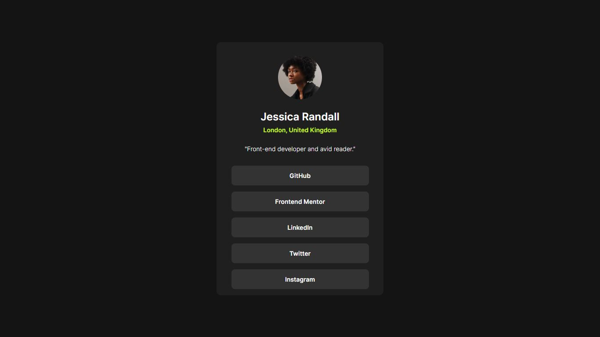

# Frontend Mentor - Social links profile solution

Esta é uma solução para o [desafio de 'Social Links Profile' do Frontend Mentor](https://www.frontendmentor.io/challenges/social-links-profile-UG32l9m6dQ).

## Visão Geral

### O Desafio

Os usuários devem ser capazes de:

- Ver os estados de foco para todos os elementos interativos na página
- Layout responsivo (1440px para desktop e 375px para dispositivos mobile)

### Captura de tela

### Links

- Solution URL: [Github/junior-leandro](https://github.com/junior-leandro/social-links-profile)
- Live Site URL: [Vercel.app](https://social-links-profile-pied.vercel.app/)

## Meu Processo de aprendizado

### DEsenvlvido com:

- HTML5
- CSS3
- TypeScript
- Flexbox
- CSS Grid
- Fluxo de trabalho Mobile-First
- [Vue.js](https://vuejs.org/) - JS library

### O Que Eu Aprendi

Este projeto foi um dos meus primeiros contatos com o framework VueJS, foi interessante entender um pouco mais e aplicar a arquitetura dessa ferramenta em um projeto para expandir meus conhecimentos e aprender a desenvolver utilizando sua estrutura.

## Autor

- Website - [junior.dev.br](https://junior.dev.br)
- Frontend Mentor - [@junior-leandro](https://www.frontendmentor.io/profile/junior-leandro)
- Instagram - [@jr_uba](https://www.instagram.com/jr_uba)

